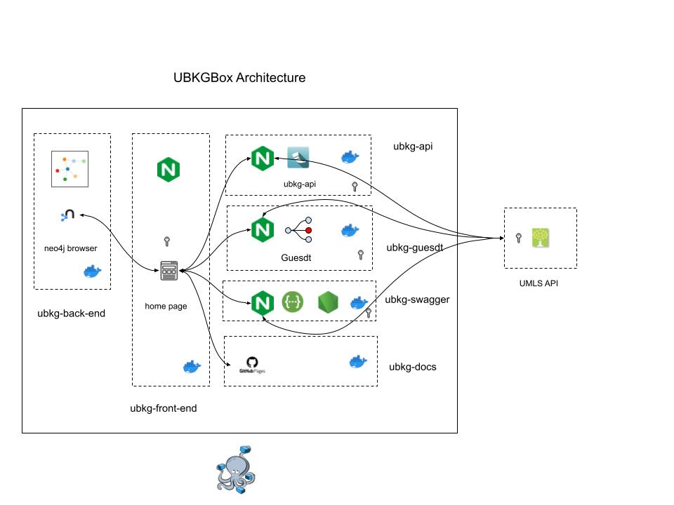

# UBKGBox

This repository describes **UBKGBox**: a self-contained, networked, multi-container UBKG application featuring:
- a container hosting a UBKG context running in neo4j, built from the [ubkg-neo4j](https://github.com/x-atlas-consortia/ubkg-neo4j) Docker architecture
- containers that work with the UBKG instance, including:
   - an instance of the UBKG API (https://github.com/x-atlas-consortia/ubkg-api), a REST API
   - Swagger documentation for the UBKG API
   - an instance of [Guesdt](https://github.com/x-atlas-consortia/Guesdt), a Web UI that represents the UBKG in tree view
   - the neo4j browser
- a front-end UI with networked links to client components, built from the [ubkg-front-end](https://github.com/x-atlas-consortia/ubkg-front-end) architecture

- **UBKGBox** consolidates components with source from different GitHub repositories. Although the component repositories will provide some documentation regarding
integration into **UBKGBox**, this repository serves as the central documentation source.

# Obtaining UBKGBox
Instances of **UBKGBox** are distributed as a Zip file that can be downloaded from the [UBKG Download](https://ubkg-downloads.xconsortia.org/) site. 
_Additional instructions pending_

# UBKGBox Architecture

**UBKGBox** deploys as a Docker Compose multi-container application. Once the distribution is unzipped, executing a Shell script will instantiate **UBKGBox** on the host machine. 

The host machine will only need to be running Docker.

# Building a UBKGBox instance
## ubkg-front-end image and container
## ubkg-api image and container
## ubkg-swagger image and container
## ubkg-docs container
