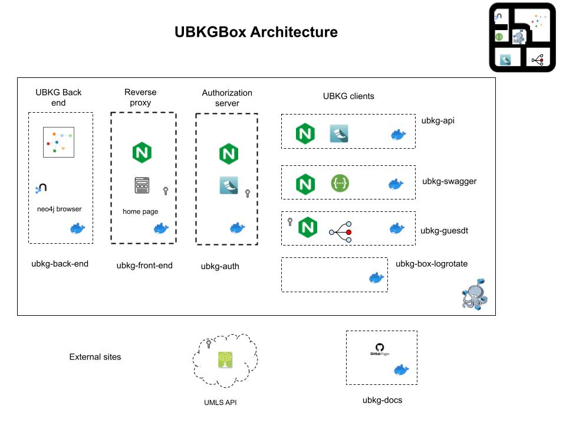

# UBKGBox

This repository describes **UBKGBox**: a self-contained, multi-component UBKG application featuring:
- a **back end** that hosts an instance of a UBKG context in neo4j
- an **API** service that queries the back-end instance
- a **front end** that:
  - acts as a reverse proxy for the API service
  - hosts the UBKGBox home page
  - hosts the **Guesdt** application
- an **authorization** service that works with the reverse proxy of the front end to authorize against the UMLS API
- a **Swagger** instance that documents the endpoints of the API

---
# UBKGBox Architecture

**UBKGBox** comprises a Docker Compose file and a shell script. 
The components of UBKGBox are built from source distributed among multiple 
GitHub repositories:

| Component     | Role                                                        | Default container (service) name | GitHub Repository                                                     |
|---------------|-------------------------------------------------------------|:---------------------------------|-----------------------------------------------------------------------|
| back end      | hosts a neo4j instance of a UBKG context                    | back-end                         | [ubkg-neo4j](https://github.com/x-atlas-consortia/ubkg-neo4j)         |
| API           | hosts an instance of the UBKG API that queries the back end | api                              | [ubkg-api](https://github.com/x-atlas-consortia/ubkg-api)             |
| authorization | authorizes against the UMLS API                             | auth                             | [ubkg-auth](https://github.com/x-atlas-consortia/ubkg-auth)           |
| front end     | reverse proxy and UI host                                   | front-end                        | [ubkg-front-end](https://github.com/x-atlas-consortia/ubkg-front-end) |
| Swagger       | (pending)                                                   | swagger                          | (pending)                                                             |

---
# Obtaining a UBKGBox distribution
Instances of **UBKGBox** are distributed as a Zip file that can be downloaded from the [UBKG Download](https://ubkg-downloads.xconsortia.org/) site.
INSTRUCTIONS PENDING 

---

# Working with UBKGBox
PENDING

---
# Building a UBKGBox distribution

The **UBKGBox** build process expands on the build process used to build a [turnkey UBKG disribution](https://github.com/x-atlas-consortia/ubkg-neo4j/blob/main/docs/BUILD_INSTRUCTIONS.md).
In particular, the **back-end** service of the **UBKGBox** application is a Docker container based on a ubkg-neo4j
image, mounted to an external volume that contains a UBKG context created by the turnkey workflow.

### Supported platforms

**UBKGBox** bash shell scripts contained are intended for use on Mac OS X or Linux. 

## UBKGBox Build Workflow

### Validate Docker Hub containers
**UBKGBox** assumes the existence of the following public Docker images in Docker Hub:

| Component     | Image tag                         |
|---------------|-----------------------------------|
| front end     | hubmap/ubkg-front-end:latest      |
| authorization | hubmap/ubkg-auth:latest           |
| api           | hubmap/ubkg-api:latest            |
| back end      | hubmap/ubkg-neo4j:current-release |

To build and publish new versions of the image for a component, 
consult the corresponding GitHub repository for instructions.

### Assemble the build directory
####  Build a turnkey UBKG Docker distribution

A turnkey distribution of a UBKG context is the foundation of a **UBKGBox** distribution. The process for building a turnkey UBKG distribution is described [here](https://github.com/x-atlas-consortia/ubkg-neo4j/blob/main/docs/BUILD_INSTRUCTIONS.md). 

After building the turnkey distribution, 

- The directory used to build the turnkey distribution will also be the directory used to build the 
**UBKGBox** distribution.
- The **container.cfg** file for the turnkey distribution will be used by the **UBKGBox** workflow to obtain the neo4j ports for the **back end** container.

#### Create api_cfg subdirectory
**UBKGBox** assumes that configuration files for the API services (**api** and **auth**) are located in a subdirectory of the build directory named **api-cfg**.
- Create the directory _api_cfg_.

#### Add files to the build directory path
###### from the ubkg-box repository
   - Copy **build_ubkgbox.sh** to the build directory. 
   - Set permissions on the script with the command `chmod +x build_ubkgbox.sh`. 
   - Copy **ubkgbox-docker-compose.yml** file to the build directory.

###### from the ubkg-api repository
The **api** service hosts an instance of ubkg-api that
is configured with a file named **app.cfg**. 
The **app.cfg** file can be created from the **app.cfg.example** file 
in the ubkg-api repository's [src](https://github.com/x-atlas-consortia/ubkg-api/tree/main/src/ubkg_api/instance) path.

- Copy the **app.cfg.example** file from the ubkg-api repository to the _api_cfg_ subdirectory of the build directory.

###### ubkg-auth repository
The **auth** service hosts an instance of ubkg-auth that is configured with 
a file named **ubkg-auth-app.cfg**. The **ubkg-auth-app.cfg** file can be 
created from the **ubkg-auth-app.example.cfg** file in the ubkg-auth repository's
[src](https://github.com/x-atlas-consortia/ubkg-auth/tree/main/src/ubkg-auth/instance) path.

- Copy the **ubkg-auth-app.cfg.example** file from the ubkg-auth repository to the _api_cfg_ subdirectory of the build directory.

### Configure components

Configurable elements are italicized.

###### app.cfg
1. Required values

| key      | value                                                    | should match                                                                                         | default value     |
|----------|----------------------------------------------------------|:-----------------------------------------------------------------------------------------------------|:------------------|
| SERVER   | 'bolt://_BACK END CONTAINER NAME_:7687'                  | the value of **container_name** for the **ubkg-back-end** service in **ubkgbox-docker-compose.yml**. | bolt://neo4j:7687 |
| USERNAME | neo4j (the username for the only user in the UBKG neo4j) |                                                                                                      | neo4j             |
| PASSWORD | the password for the neo4j user                          | the value of the neo4j_password key in **container.cfg**                                             | abcd1234          | 

2. Optional values for query management
It is possible to configure the instance of the ubkg-api instance in the **api** service container 
to manage API resources by setting values of keys in the external **app.cfg** file. 

For instructions to configure query management, consult the README.md in the ubkg-api repository, notably:
- [Optional Timeout Feature](https://github.com/x-atlas-consortia/ubkg-api/tree/main?tab=readme-ov-file#optional-timeout-feature)
- [Payload Size Limitation with Optional S3 Redirect](https://github.com/x-atlas-consortia/ubkg-api/tree/main?tab=readme-ov-file#payload-size-validation-with-optional-s3-redirection)

The **app.cfg** file for the instance of ubkg-api in the **api** service container
does not mplement query management features of the ubkg-api by default.

###### ubkg-auth-app.cfg
The configuration file for the **auth** container (**ubkg-auth-app.cfg**) currently contains
only the URL base for the UMLS API, which is also in **ubkg-auth-app.cfg.example**.

###### ubkg-docker-compose.yml
The only items in **ubkg-docker-compose.yml** that can be changed without significant consequence are the values of **container_name**--i.e.,
the custom names for the containers. 

The value of **container_name** for the **ubkg-back-end** service must match the value used in the 
**SERVER** key of the ubkg-api instance's **app.cfg**.

### Compose the application

From a Terminal session, execute `./build_ubkgbox.sh up`. 
The **build_ubkgbox.sh** script will:
   - validate and obtain information from **container.cfg**.
   - execute Docker Compose on **ubkg-box-docker-compose.yml**.

As **build_ubkg_box.sh** executes, it will display messages to the Terminal window emitted from component 
service containers as they build.

The messages from the back end container will be identical to those displayed during the build of the turnkey Docker distribution.

When **build_ubkb_box.sh** executes, the Container view of Docker Desktop will show:
- a container named **ubkgbox**
- subcontainers with the following default names:
  - _front-end_ 
  - _neo4j_
  - _api_
  - _auth_
  - _swagger_

Container ports will have the following links:

| Container default name | default port        | link                                                      |
|------------------------|---------------------|-----------------------------------------------------------|
| neo4j                  | port mapped to 7474 | neo4j browser (HTTP)                                      |
| n3o4j                  | port mapped to 7687 | neo4j bolt                                                |
| front-end              | 7100:8080           | UBKGBox home page                                         |
| api                    | 7000:8080           | root of UBKGBox instance of the UBKG API                  |
| auth                   | 7100:8080           | root of UBKGBox instance of the (UMLS) authentication API |

