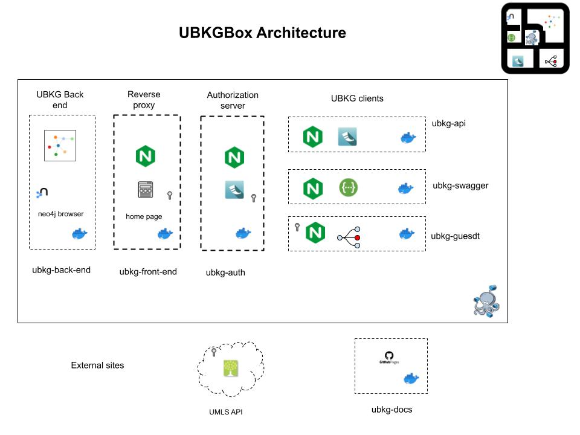

# Unified Biomedical Knowledge Graph
# UBKGBox application

This repository describes **UBKGBox**: a self-contained, multi-component UBKG application environment featuring:
- a **back end** that hosts an instance of a UBKG context in neo4j
- a **front end** that:
  - acts as a reverse proxy for other client services
  - hosts the UBKGBox home page
- an **authorization** service that works with the reverse proxy of the front end to authorize against the UMLS API
- UBKG client services that work with the neo4j instance hosted in the back end service, including:
  - an **API** service  
  - a **guesdt** service that hosts an instance of the **Guesdt** client that executes endpoints of the API service
 

---
# UBKGBox Architecture

The **UBKGBox** application comprises:
- a Docker Compose file (**ubkgbox-docker-compose.yml**)
- a Docker turnkey distribution of UBKG, either [built locally](https://github.com/x-atlas-consortia/ubkg-neo4j/blob/main/docs/BUILD_INSTRUCTIONS.md) or obtained from the [UBKG Downloads](https://ubkg-downloads.xconsortia.org/) site
- the configuration file for the Docker turnkey distribution (**container.cfg**)
- a build script (**build_ubkgbox.sh**)
- a script to add network subnodes required for **UBKGBox** (**add_subnodes_to_host.sh**)
- a custom Swagger initialization file (**swagger-initializer.js**)

The components of UBKGBox are Docker containers that are built from source distributed among multiple 
GitHub repositories, with images published in Docker Hub:

| Component     | Role                                                             | Service name   | Default container name        | GitHub Repository                                                     |
|---------------|------------------------------------------------------------------|:---------------|:------------------------------|-----------------------------------------------------------------------|
| back end      | hosts a neo4j instance of a UBKG context                         | ubkg-back-end  | back-end                      | [ubkg-neo4j](https://github.com/x-atlas-consortia/ubkg-neo4j)         |
| API           | hosts an instance of the UBKG API that queries the back end      | ubkg-api       | api                           | [ubkg-api](https://github.com/x-atlas-consortia/ubkg-api)             |
| authorization | authorizes against the UMLS API                                  | ubkg-auth      | auth                          | [ubkg-auth](https://github.com/x-atlas-consortia/ubkg-auth)           |
| front end     | reverse proxy and UI host                                        | ubkg-front-end | front-end                     | [ubkg-front-end](https://github.com/x-atlas-consortia/ubkg-front-end) |
| guesdt        | hosts an Guesdt instance that executes endpoints of the UBKG API | ubkg-guesdt    | guesdt                        | [Guesdt](https://github.com/x-atlas-consortia/Guesdt)                 |
| swagger       | Swagger UI instance that executes endpoints of the UBKG API      | ubkg-swagger   | swagger                       | none                                                                  |

---
# Obtaining and using a UBKGBox distribution
Refer to [Using UBKGBox](https://github.com/x-atlas-consortia/ubkg-box/blob/main/documentation/Using%20UBKGBox.md).

---
# Building a UBKGBox distribution

The **UBKGBox** build process expands on the build process used to build a [turnkey UBKG disribution](https://github.com/x-atlas-consortia/ubkg-neo4j/blob/main/docs/BUILD_INSTRUCTIONS.md).
In particular, the **back-end** service of the **UBKGBox** application is a Docker container based on a ubkg-neo4j
image, mounted to an external volume that contains a UBKG context created by the turnkey workflow.

### Supported platforms

**UBKGBox** bash shell scripts contained are intended for use on Mac OS X or Linux. 

## UBKGBox Build Workflow

### Validate Docker Hub containers
**UBKGBox** assumes the existence of the following public Docker images in Docker Hub:

| Component     | Image tag                                                                                     |
|---------------|-----------------------------------------------------------------------------------------------|
| front end     | [hubmap/ubkg-front-end:latest](https://hub.docker.com/r/hubmap/ubkg-front-end/tags)           |
| authorization | [hubmap/ubkg-auth:latest](https://hub.docker.com/r/hubmap/ubkg-auth/tags)                     |
| api           | [hubmap/ubkg-api:latest](https://hub.docker.com/r/hubmap/ubkg-api/tags)                       |
| back end      | [hubmap/ubkg-neo4j:current-release](https://hub.docker.com/r/hubmap/ubkg-neo4j)               |
| guesdt        | [hubmap/ubkg-guesdt:latest](https://hub.docker.com/repository/docker/hubmap/ubkg-guesdt/tags) |

To build and publish new versions of the image for a particular component, 
consult the corresponding GitHub repository for instructions.

### Assemble the build directory
####  Build a turnkey UBKG Docker distribution

A turnkey distribution of a UBKG context is the foundation of a **UBKGBox** distribution. The process for building a turnkey UBKG distribution is described [here](https://github.com/x-atlas-consortia/ubkg-neo4j/blob/main/docs/BUILD_INSTRUCTIONS.md). 

After building the turnkey distribution, 

- The directory used to build or instantiate the turnkey distribution locally will also be the directory used to build the 
**UBKGBox** distribution.

#### Create api_cfg subdirectory
**UBKGBox** assumes that configuration files for the API services (**api** and **auth**) are located in a subdirectory of the build directory named **api-cfg**.
- Create the directory _api_cfg_.

#### Add files to the build directory path
###### from the ubkg-box repository
   - Copy the following scripts to the build directory:
     - **build_ubkgbox.sh** 
     - **add_subnodes_to_host.sh**
     - **build_ubkgbox_distribution_zip.sh**
   - If necessary, set permissions on the scripts with the command `chmod +x`. 
   - Copy **ubkgbox-docker-compose.yml** to the build directory.
   - Copy **swagger-initializer.js** to the build container.

###### from the ubkg-api repository
The **api** service hosts an instance of ubkg-api that
is configured with a file named **app.cfg**. 
The **app.cfg** file can be created from the **app.cfg.example** file 
in the ubkg-api repository's [src](https://github.com/x-atlas-consortia/ubkg-api/tree/main/src/ubkg_api/instance) path.

- Copy the **app.cfg.example** file from the ubkg-api repository to the _api_cfg_ subdirectory of the build directory.

###### ubkg-auth repository
The **auth** service hosts an instance of ubkg-auth that is configured with 
a file named **ubkg-auth-app.cfg**. The **ubkg-auth-app.cfg** file can be 
created from the **ubkg-auth-app.example.cfg** file in the ubkg-auth repository's
[src](https://github.com/x-atlas-consortia/ubkg-auth/tree/main/src/ubkg-auth/instance) path.

- Copy the **ubkg-auth-app.cfg.example** file from the ubkg-auth repository to the _api_cfg_ subdirectory of the build directory.

### Configure components

Configurable elements are italicized.

###### container.cfg
Although the purpose of **container.cfg** is to configure the build of a turnkey Docker UBKG distribution, it can be used to change the password of the neo4j user account in the neo4j database.
The **UBKGBox** build script uses no configuration information from **container.cfg** other than _neo4j_password_.

###### app.cfg
1. Required values

| key      | value                                                    | should match                                                                                         | default value     |
|----------|----------------------------------------------------------|:-----------------------------------------------------------------------------------------------------|:------------------|
| SERVER   | 'bolt://_BACK END CONTAINER NAME_:7687'                  | the value of **container_name** for the **ubkg-back-end** service in **ubkgbox-docker-compose.yml**. | bolt://neo4j:7687 |
| USERNAME | neo4j (the username for the only user in the UBKG neo4j) |                                                                                                      | neo4j             |
| PASSWORD | the password for the neo4j user                          | the value of the neo4j_password key in **container.cfg**                                             | abcd1234          | 

2. Optional values for query management
It is possible to configure the instance of the ubkg-api instance in the **api** service container 
to manage API resources by setting values of keys in the external **app.cfg** file. 

For instructions to configure query management, consult the README.md in the ubkg-api repository, notably:
- [Optional Timeout Feature](https://github.com/x-atlas-consortia/ubkg-api/tree/main?tab=readme-ov-file#optional-timeout-feature)
- [Payload Size Limitation with Optional S3 Redirect](https://github.com/x-atlas-consortia/ubkg-api/tree/main?tab=readme-ov-file#payload-size-validation-with-optional-s3-redirection)

The **app.cfg** file for the instance of ubkg-api in the **api** service container
does not implement query management features of the ubkg-api by default.

###### ubkg-auth-app.cfg
The configuration file for the **auth** container (**ubkg-auth-app.cfg**) currently contains
only the URL base for the UMLS API, which is also in **ubkg-auth-app.cfg.example**.

###### ubkg-docker-compose.yml
The only items in **ubkg-docker-compose.yml** that can be changed without significant consequence are the values of **container_name**--i.e.,
the custom names for the containers. 

The value of **container_name** for the **ubkg-back-end** service must match the value used in the 
**SERVER** key of the ubkg-api instance's **app.cfg**.

###### ubkg-swagger and swagger-initializer.js
Unlike the other UBKGBox services, **ubkg-swagger** uses the official Swagger UI Docker image (_swaggerapi/swagger-ui_).
No Dockerfile is needed: all information is in **ubkgbox-docker-compose.yml**.

Linking the Swagger UI instance in **ubkg-swagger** to the ubkg-api instance in the **ubkg-api** service
requires that the file **swagger-initialize.js** be located in the same directory as **ubkgbox-docker-compose.yml**.
The url in **swagger-initialize.js** should point to the raw location of the OpenAPI specification file in the ubkg-api repo
for the ubkgbox implementation.

### Compose the application

From a Terminal session, execute `./build_ubkgbox.sh`. 
The **build_ubkgbox.sh** script will:
   - add a subnode to the local hosts file named **neo4j.ubkgbox.com**, mapped to the localhost/loopback IP.
   - validate and obtain information from **container.cfg**.
   - execute Docker Compose on **ubkg-box-docker-compose.yml**.

As **build_ubkg_box.sh** executes, it will display messages to the Terminal window emitted from component 
service containers as they build.

The messages from the back end container will be identical to those displayed during the build of the turnkey Docker distribution.

When **build_ubkb_box.sh** executes, the Container view of Docker Desktop will show:
- a container named **ubkgbox**
- subcontainers with the following default names:
  - _front-end_ 
  - _neo4j_
  - _api_
  - _auth_
  - _Guesdt_
  - _swagger_

The **ubkg-front-end** container is the only container in **UBKGBox** that will have external ports:
- 7000 for the **UBKGBox** home page
- 7001 to map to the internal bolt port of the neo4j server hosted in **ubkg-back-end**.

### Build the distribution Zip
Execute `./build_ubkgbox_distribution_zip.sh`.

The script will:
1. Stop the neo4j server hosted by the **ubkg-back-end** service and the service container itself. Stopping the neo4j service stabilizes the content of the database for Zip archival.
2. Build a Zip archive of the **UBKGBox** components named **UBKGBox.zip**.

### Upload to Globus
1. Add release notes or other documents as needed to **UBKGBox.zip**.
2. Rename **UBKGBox.zip** to a unique value--e.g., with a date stamp.
3. Publish the distribution to the UBKG Downloads site:
   - Upload the Zip file to the folder in the designated Globus collection.
   - Update the **file_descriptions.json** file in the folder to reflect the new distribution.

# UBKGBOX subnodes

**UBKGBox** defines a network subnode named _neo4j.ubkg.com_ to support reverse proxying to the neo4j browser
application hosted in the **ubkg-back-end** service.

The UBKG build script (**build_ubkgbox.sh**) calls the script **add_subnodes_to_host.sh** to add subnodes to the host.

By default, _neo4j.ubkgbox.com_ maps to the localhost/loopback IP on the local machine (127.0.0.1).

Because modifying the hosts file requires administrative privileges, the **add_subnodes_to_host** script
will ask for an administrative password.

---

# Logging
**UBKGBox** provides logs for all components except for **ubkg-swagger**.
These logs are external volumes exported from the Docker service containers of **UBKGBox**. 
**UBKGBox** logs will be located in the _/log_ubkgbox_ subdirectory of the build directory.

The _logs_ directory countains the logs of the neo4j instance in **ubkg-back-end**. The _logs_
directory name is consistent with the external volume mounted by the turkey Docker distribution.

| Component | log sub directory | log                             | purpose                                       |
|-----------|-------------------|---------------------------------|:----------------------------------------------|
| back end  | logs              | various                         | logs from the neo4j instance in the back end  |
| front end | log               | nginx_access_ubkg-front-end.log | HTTP calls made to the front end              |
|           |                   | nginx_error_ubkg-front-end.log  | errors from the front end                     |
| api       | log               | ubkg-api.log                    | UBKG API log                                  |
|           |                   | nginx_access_ubkg-api.log       | HTTP calls made to the UBKG API               |
|           |                   | nginx_error_ubkg-api.log        | errors from the web host of the UBKG API      |
| auth      | log               | ubkg-auth.log                   | ubkg-auth API log                             |
|           |                   | nginx_access_ubkg-auth.log      | HTTP calls made to the ubkg-auth API          |
|           |                   | nginx_error_ubkg-auth.log       | errors from the Web host of the ubkg-auth API |
| Guesdt    | log               | nginx_access-guesdt.log         | HTTP calls made to the Guesdt application     |
|           |                   | nginx_error-guesdt.log          | errors from the front end related to Guesdt   |

