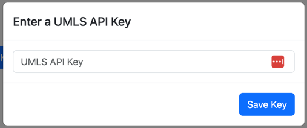
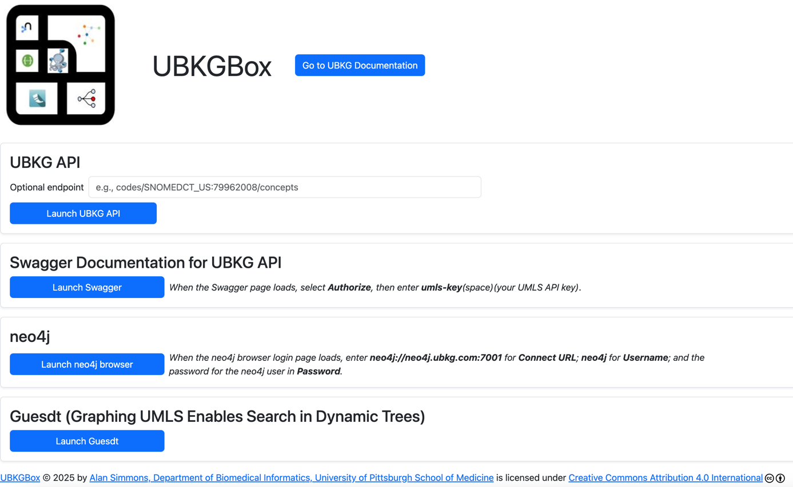
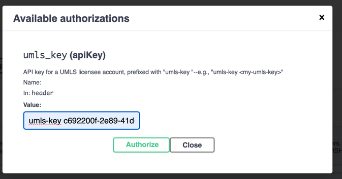
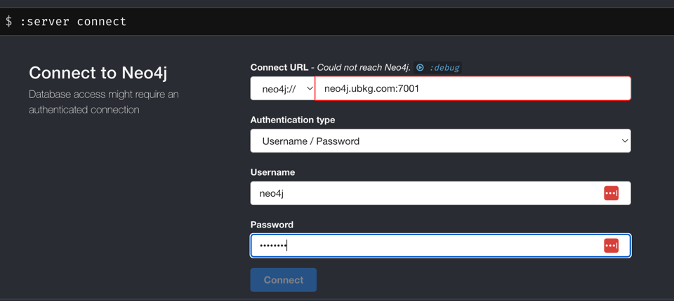
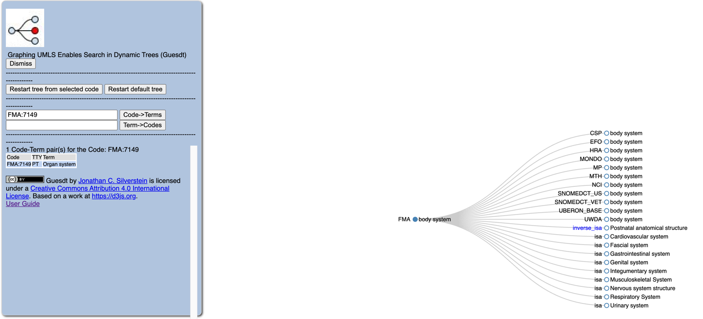

# Unified Biomedical Knowledge Graph
# Using UBKGBox

**UBKGBox** is a self-contained, multi-component UBKG application environment featuring:
- a **back end** that hosts an instance of a UBKG context in neo4j
- a **front end** that:
  - acts as a reverse proxy for other client services
  - hosts the UBKGBox home page
- an **authorization** service that works with the reverse proxy of the front end to authorize against the UMLS API
- UBKG client services that work with the neo4j instance hosted in the back end service, including:
  - an **API** service  
  - a **guesdt** service that hosts an instance of the **Guesdt** client that executes endpoints of the API service
  - a **Swagger** instance that documents endpoints of the API and is linked to the **UBKGBox** api instance

The components of **UBKGBox** interact within an internal network and are available only after the user provides a valid UMLS API key
in the **UBKGBox** home page.

# UMLS Licensing and the UMLS API key

The Unified Biomedical Knowledge Graph (UBKG) instance in **UBKGBox** includes content from biomedical vocabularies that are maintained by the National Library of Medicine in the Unified Medical Language System (UMLS). 
The use of content from the UMLS is governed by the [UMLS License Agreement](https://uts.nlm.nih.gov/uts/assets/LicenseAgreement.pdf).

Users of **UBKGBox** must provide the API key that is part of their [UMLS Technology Services (UTS)](https://uts.nlm.nih.gov/uts/) accounts.

To obtain a UMLS API key, 
1. Visit the [UTS](https://uts.nlm.nih.gov/uts/) site.
2. Create a UTS user profile.
3. Generate an API key for your profile.

# Good faith use
**UBKGBox** makes a reasonable attempt to protect UBKG content by means of a reverse proxy that authenticates users against
the UMLS API before allowing access to **UBKGBox** components. However, because **UBKGBox** is open source, a determined 
user would be able to build an instance of the UBKG neo4j component that does not require authentication.

The University of Pittsburgh offers **UBKGBox** to users with the understanding that users will use the UBKG content in a licensed manner. 
In particular, the user agrees not to make UBKG content available from a public website.

# Obtaining a UBKGBox distribution
Zip archives of **UBKGBox** distributions are available at the [UBKG Downloads](https://ubkg-downloads.xconsortia.org/) page.
Follow the instructions on the site to download a distribution.

# Installation

## Docker Desktop
**UBKGBox** is a Docker Compose application. Before installing **UBKGBox**, [install Docker](https://docs.docker.com/engine/install/) on the host machine.

## Host resources

1. The host machine will require considerable disk space to accomodate **UBKGBox**'s UBKG instance, depending on the UBKG distribution. For example, as of December 2023, distribution sizes were around:
   - HuBMAP/SenNet: 9GB
   - Data Distillery: 20GB
2. The host machine should have at least 16 GB of RAM.
3. The **UBKGBox** build script must create a network subnode (currently, just the subnode _neo4j.ubkgbox.com_) that maps to the localhost/loopback IP (172.0.0.1). This requires that the user who runs the build script be able to run _sudo_.

## Build script
1. Unzip the distribution archive zip obtained from the UBKG Download site.
2. Move to the unzipped directory.
3. Start a Terminal window.
4. Execute `./build_ubkgbox.sh`.
5. Provide a _sudo_ password to the script.
6. The build script requires fewer than 5 minutes to complete. The script will write many messages to the Terminal window as it builds its components. 
7. The build script finishes with the message `UBKBox is ready.` 
8. Once the build script finishes, the Terminal window will be in console mode and will not accept further input from the user. The window does not need to be open for **UBKGBox** to run.

# UBKGBox initialization and refreshing

When a Cypher query is executed for the first time in a new neo4j instance, neo4j
must add the query plan to its [plan cache](https://neo4j.com/developer/kb/understanding-the-query-plan-cache/). 
Plan caching results in the initial execution of the query taking longer than subsequent executions.

In the **API** component of **UBKGBox**, the initial execution of an endpoint may fail with a HTTP 500 error 
because of delays or other issues related to query plan caching in the neo4j database. These errors can 
result in failures of both the ubkg-api or **UBKGBox** components that depend on the ubkg-api, such as Guesdt and Swagger.

The build script mitigates the risk of initial API failures for the user by executing a set of API endpoints. 
Even with this "priming", though, the inital interaction with the ubkg-api may fail. Subsequent interactions should not fail, however.

If the initial use of a **UBKGBox** component fails, the user should be able simply to refresh the page or re-execute.

# Using UBKGBox

## Home page
1. Open the **UBKGBox** home page at http://localhost:7000/.
2. **UBKGBox** will check for a UMLS API key for the user. 
   - If the user has not provided a key, a modal box will appear:
   
   - When the user provides a key, **UBKGBox** will store the key value in a session cookie. **UBKGBox** will not prompt for a UMLS key unless the cookie either expires or is removed.
   - 

3. The Home page displays buttons that launch component applications.

### UBKG Documentation link
The **Go to UBKG Documentation** button will open the [UBKG Documentation](https://ubkg.docs.xconsortia.org/) root in another tab.

### UBKG API

The UBKG API component in **UBKGBox** queries the UBKG neo4j instance hosted by the **UBKGBox** back end component.

1. Enter the string for a UBKG API endpoint--e.g., `codes/SNOMEDCT_US:79962008/concepts`.
2. The **Launch UBKG API** button will open a new tab that contains the response from the ubkg-api. 
3. For more information on UBKG API endpoints, consult:
   - the **UBKGBox** Swagger component described below
   - the [API page](https://ubkg.docs.xconsortia.org/api/) of the UBKG Documentation. Note that this page refers to the OpenAPI specification for a public instance of UBKG, and not the instance in **UBKGBox**.
4. If the initial call to the endpoint fails, either refresh the API response page or re-execute the endpoint in the **UBKGBox** home page.

### Swagger Documentation for UBKG API

The Swagger page describes the UBKG API instance of **UBKGBox**. The Swagger page executes API endpoints that query the UBKG neo4j instance hosted by the **UBKGBox** back end.

1. The **Launch Swagger** button will open a Swagger page that is linked to the **UBKGBox**'s instance of the UBKG API.
2. Because the Swagger UI does not support Single Sign On with reverse proxies, you will need to authorize the Swagger page manually. 
   - On the Swagger page, click the green **Authorize** button.
   - Authorize by entering the string 'umls-key', then space, then your UMLS key.
   
   - Click **Authorize**.
   - Once you have entered the authorization string once, Swagger stores it as a cookie, and it will be available in a drop-down.
3. Build and execute queries using Swagger's **Try It Out** feature.

### neo4j

**UBKGBox**'s neo4j component featues a neo4j browser that works directly against the instance of UBKG hosted by the **UBKG
Box** back end component.

1. The **Launch neo4j Browser** button opens the neo4j browser in another tab.
2. Because the neo4j Browser does not currently support Single Sign On with the **UBKGBox** reverse proxy, you will need to provide connection information to the login:
   - **ConnectURL**: neo4j://neo4j.ubkg.com:7001
   - **Username**: neo4j
   - **Password**: the password for the UBKG instance. The default password is **abcd1234**; if the password was changed, it will be in the file named **app.cfg** in the subdirectory _api_config_ of the application directory.
3. Once you connect to the UBKG instance, the neo4j browser may populate the **ConnectURL** on subsequent loads of the browser.

### Guesdt (Graphing UMLS Enables Search in Dynamic Trees)
The Guesdt component of **UBKGBox** visualizes the UBKG instance of **UBKGBox** in a tree view. 
1. The **Launch Guesdt** button opens Guesdt in another tab.
2. The User Guide link at the bottom of the popup window at the left will open the Guesdt User Guide.

When Guesdt loads, it populates its display with information related to the code FMA:7149. 
The complete page features a popup window to the left of the screen and a tree view to the right, 
as illustrated below. 

Because Guesdt is a client of the UBKG API component, the intial load of Guesdt may be incomplete because of API failure. 
If the initial load of Guesdt is incomplete, refresh the page.

